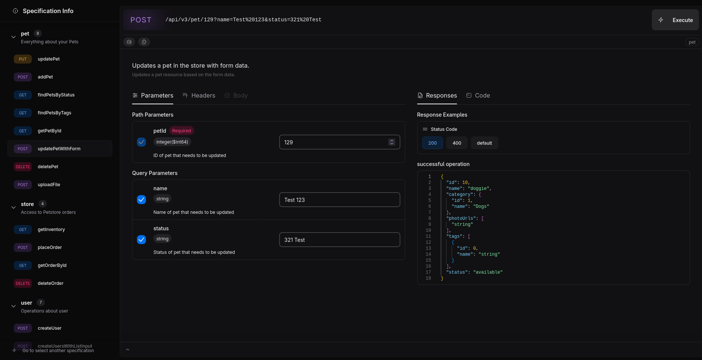

# Swagman UI Express

A simple library to serve ["Swagman Web"](https://github.com/NahueTomas/swagman-web) in Express applications.


## 🚀 Install

```bash
npm install swagman-ui-express
```

## 📖 Basic Usage

```javascript
const express = require("express");
const swagmanUI = require("swagman-ui-express");

const app = express();

// Your OpenAPI/Swagger specification
const swaggerDoc = {
  openapi: "3.0.0",
  info: {
    title: "My API",
    version: "1.0.0",
  },
  paths: {
    "/users": {
      get: {
        summary: "Get users",
        responses: {
          200: {
            description: "List of users",
          },
        },
      },
    },
  },
};

// Serve documentation at /api-docs
app.use("/api-docs", swagmanUI.serve, swagmanUI.setup(swaggerDoc));

app.listen(3000, () => {
  console.log("Server running on http://localhost:3000");
  console.log("Documentation available at http://localhost:3000/api-docs");
});
```

## 🔧 API

### `swagmanUI.serve`

Static middleware to serve Swagman Web assets.

### `swagmanUI.setup(swaggerDoc, options)`

**Parameters:**

- `swaggerDoc` (Object) - Your OpenAPI/Swagger specification object
- `options.title` (string, optional) - Custom page title (default: uses "Swagman Web")

**Returns:** Express middleware function

## 📝 License

MIT © NahueTomas
